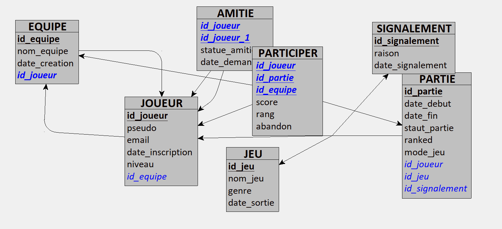

# ProjetDB_Cheng_Dib
# Mini-projet Bases de données-Partie 1 

## Membres du groupe 
-Eloi CHENG
-Riad DIB

## Objectif 
Ce projet consiste à appliquer la méthode MERISE pour concevoir une base de données.
La partie 1 correspond à l'analyse des besoins et à la création du MCD. 

## Domaine choisi 

Nous avons choisi le domaine suivant :
Plateforme de jeux vidéo en ligne.

Ce domaine permet de gérer:
- des joueurs 
- des jeux 
- des parties
- du score 
- des équipes 

## Prompt utilisé 

Tu travailles dans le domaine d’une plateforme de jeux vidéo en ligne.
Ton entreprise a comme activité la gestion d’une plateforme permettant aux joueurs de créer un compte, rejoindre des parties, jouer à différents jeux, enregistrer des scores, former des équipes et interagir socialement.

C’est une entreprise de service numérique comme Steam, Epic Games, Xbox Live ou PlayStation Network.
Les données ont été collectées à partir :
- de la gestion des profils joueurs,
- des systèmes de parties multijoueurs,
- des classements et scores,
- des équipes et groupes de joueurs

Inspire-toi du fonctionnement général des plateformes de jeux vidéo en ligne et des systèmes multijoueurs modernes :
- https://store.steampowered.com
- https://www.epicgames.com
- https://www.xbox.com
- https://www.playstation.com

Ton entreprise veut appliquer MERISE pour concevoir un système d’information.
Tu es chargé de la partie analyse, c’est-à-dire de collecter les besoins auprès de l’entreprise.
Elle a fait appel à un étudiant en ingénierie informatique pour réaliser ce projet, tu dois lui fournir les informations nécessaires pour qu’il applique ensuite lui-même les étapes suivantes de conception et développement de la base de données.

D’abord, établis les règles de gestion des données de ton entreprise, sous la forme d’une liste à puces.
Elle doit correspondre aux informations que fournit quelqu’un qui connaît le fonctionnement de l’entreprise, mais pas comment se construit un système d’information.

Ensuite, à partir de ces règles, fournis un dictionnaire de données brutes avec les colonnes suivantes, regroupées dans un tableau :
- signification de la donnée
- type
- taille en nombre de caractères ou de chiffres

Il doit y avoir entre 25 et 35 données.
Le dictionnaire sert à fournir des informations supplémentaires sur chaque donnée (taille et type) sans indiquer comment les données seront modélisées ensuite.

Fournis donc les règles de gestion et le dictionnaire de données.

## Règles de gestion

- Un joueur possède un identifiant unique.
- Le pseudo d’un joueur est obligatoire et unique.
- L’email d’un joueur est obligatoire et unique.
- Un joueur peut participer à plusieurs parties, mais au plus une fois par partie.
- Une partie concerne un seul jeu.
- Une partie a une date/heure de début et un statut (planifiée, en_cours, terminée, annulée).
- Chaque participation d’un joueur à une partie enregistre un score (score ≥ 0) et éventuellement un rang (rang ≥ 1).
- Un joueur peut ajouter un autre joueur en ami (relation joueur↔joueur) avec un statut (en_attente, acceptée, refusée, bloquée).
- Un joueur peut appartenir à une équipe.
- Une équipe possède un nom unique et un capitaine.
- En mode équipe, les scores peuvent être associés à l’équipe du joueur.

## Dictionnaire de données

| Donnée | Signification | Type | Taille |
|---|---|---|---|
| id_joueur | Identifiant unique du joueur | INT | 10 |
| pseudo | Nom public du joueur | VARCHAR | 30 |
| email | Email du joueur | VARCHAR | 120 |
| date_inscription | Date d’inscription | DATE | 10 |
| niveau | Niveau du joueur | INT | 3 |
| id_jeu | Identifiant du jeu | INT | 10 |
| nom_jeu | Nom du jeu | VARCHAR | 80 |
| genre | Genre du jeu | VARCHAR | 40 |
| date_sortie | Date de sortie du jeu | DATE | 10 |
| id_partie | Identifiant de la partie | INT | 10 |
| date_debut | Date/heure début partie | DATETIME | 19 |
| date_fin | Date/heure fin partie | DATETIME | 19 |
| statut_partie | Statut de la partie | VARCHAR | 15 |
| ranked | Partie classée ou non | BOOLEAN | 1 |
| mode_jeu | Mode (solo/equipe) | VARCHAR | 10 |
| score | Score d’un joueur dans une partie | INT | 10 |
| rang | Rang d’un joueur dans une partie | INT | 3 |
| abandon | Indique un abandon | BOOLEAN | 1 |
| id_equipe | Identifiant d’équipe | INT | 10 |
| nom_equipe | Nom de l’équipe | VARCHAR | 50 |
| date_creation_equipe | Date création équipe | DATE | 10 |
| id_capitaine | Joueur capitaine | INT | 10 |
| id_joueur_1 | Joueur 1 (amitié) | INT | 10 |
| id_joueur_2 | Joueur 2 (amitié) | INT | 10 |
| statut_amitie | Statut de la relation | VARCHAR | 12 |
| date_demande | Date demande d’amitié | DATETIME | 19 |
| date_decision | Date décision d’amitié | DATETIME | 19 |

## Analyse du résultat 

Le résultat généré par l’IA est cohérent avec le domaine choisi : il couvre les joueurs, jeux, parties, scores, équipes et relations sociales.
Le nombre de données du dictionnaire est conforme (26).

Ajustements réalisés :
- reformulation de certaines règles pour les rendre plus claires,
- harmonisation des noms des données,
- suppression/éviction d’éléments trop techniques non nécessaires au niveau conceptuel.

(MCD)

(MLD)

